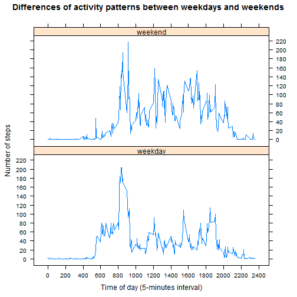

# Reproducible Research: Peer Assessment 1  


## Loading and Preprocessing the data

1st: set the working directory and seed value for reproducibility

```r
setwd("C:/RWork/DataScience/05-ReproducibleResearch/Assignment1")
set.seed(1234567)
```
2nd: Download file from appropriate URL and extract csv file

```r
url <- 'http://d396qusza40orc.cloudfront.net/repdata%2Fdata%2Factivity.zip'
download.file(url, 'repdata-data-activity.zip')
unzip('repdata-data-activity.zip')
```
3rd: Read csv file

```r
DF <- read.csv("activity.csv", header=TRUE, sep=",", stringsAsFactor=FALSE)
```
4th: Just for presentation purpose, create a function converting "5-min interval" values into "time" values (hh:mm)

```r
timeValue <- function(interval){
     if(interval<10){
          timeval=paste('00:0',as.character(interval), sep="")
     } else if(interval<100){
          timeval=paste('00:',as.character(interval), sep="")
     } else if(interval<1000){
          timeval=paste('0', 
                           substr(as.character(interval), 1, 1),":",
                           substr(as.character(interval), 2, 3),
                           sep="")
     } else timeval=paste(substr(as.character(interval), 1, 2),":",
                             substr(as.character(interval), 3, 4), 
                             sep="")
     timeval
}
```
5th: Give some info and summary of variables

```r
str(DF)
```

```
## 'data.frame':	17568 obs. of  3 variables:
##  $ steps   : int  NA NA NA NA NA NA NA NA NA NA ...
##  $ date    : chr  "2012-10-01" "2012-10-01" "2012-10-01" "2012-10-01" ...
##  $ interval: int  0 5 10 15 20 25 30 35 40 45 ...
```

```r
summary(DF)
```

```
##      steps            date              interval     
##  Min.   :  0.00   Length:17568       Min.   :   0.0  
##  1st Qu.:  0.00   Class :character   1st Qu.: 588.8  
##  Median :  0.00   Mode  :character   Median :1177.5  
##  Mean   : 37.38                      Mean   :1177.5  
##  3rd Qu.: 12.00                      3rd Qu.:1766.2  
##  Max.   :806.00                      Max.   :2355.0  
##  NA's   :2304
```


## What is mean total number of steps taken per day?

Let's generate the total number of steps per day using aggregate function and store these results in a file:

```r
totalPerDay  <- aggregate(DF$steps ~ DF$date, data = DF, FUN=sum, na.rm=TRUE)
names(totalPerDay) <- c("date", "steps")
```

And now, let's plot an histogram of the total number of steps per day:

```r
library(ggplot2)
ggplot(totalPerDay, aes(x=totalPerDay$steps)) + 
     labs(title = "Distribution of the total number of steps per day\n-data gathered over a 2 months period-",
          x = "Total number of steps per day",y = "Frequency count") +
     geom_histogram(binwidth=3000, colour="black", fill="lemonchiffon3") +
     scale_x_continuous(limits = c(0, max(totalPerDay$steps)), breaks = seq(0, max(totalPerDay$steps), 2500)) +
     scale_y_continuous(limits = c(0, 20), breaks = seq(0, 20, 2.5))
```

 

Lastly, let's compute the mean and median of the total number of steps per day:

```r
meanSteps <- format(mean(totalPerDay$steps), digits=6, decimal.mark=",")
medianSteps <- median(totalPerDay$steps)
```

Which gives a mean for the total number of steps per day of **10766,2**, and a median for the total number of steps per day of **10765**.  

Note that mean and median are very close, it is probable that the variable "total number of steps per day" follows a normal distribution (which can also be infered from the histogram).  


## What is the average daily activity pattern?

Let's compute the average number of steps by interval over all days:

```r
avgPerDay  <- aggregate(DF$steps ~ DF$interval, data = DF, FUN=mean, na.rm=TRUE)
names(avgPerDay) <- c("interval", "steps")
```
  
And now, let's make a time-serie plot of the 5-minutes interval and the average number of steps taken, averaged across all days:

```r
library(ggplot2)
ggplot(avgPerDay, aes(x=avgPerDay$interval)) + 
     labs(title = "Average number of steps as a function of daily time\n-data gathered over a 2 months period-",
          x = "Time of the day (5-minutes interval)", y = "Average number of steps") +
     geom_line(data = avgPerDay, aes(x = avgPerDay$interval, y = avgPerDay$steps), color = "purple3") +
     scale_x_continuous(limits = c(0, 2400), breaks = seq(0, 2400, 200)) +
     scale_y_continuous(limits = c(0, max(avgPerDay$steps)), breaks = seq(0, max(avgPerDay$steps), 20))
```

 
  
Let's now determine which 5-minutes interval, on average across all the days in the dataset, contains the maximum number of steps:

```r
maxInterval <- avgPerDay[which.max(avgPerDay$steps),"interval"]
maxTime <- timeValue(maxInterval)
maxSteps <- format(max(avgPerDay$steps), digits=4, decimal.mark=",")
```
  
Thus, the time interval with the **max average number of steps per day (n = 206,2)** occurs **in the morning** at **835** (or **08:35**).  


## Imputing missing values  

1) Calculate and report the total number of missing values in the dataset (i.e. the total number of rows with NAs):  

There are days with no "steps"" values at all. These values are coded as "NA" in the dataset. The code below will compute the total number of missing values:

```r
nbmiss <- sum(is.na(DF$steps))
nbdays <- nbmiss/288
```
Thus, there is a total of **2304** missing values, which means that **8** days have no data at all.  
  
2) Devise a strategy for filling in all of the missing values in the dataset. The strategy does not need to be sophisticated. For example, you could use the mean/median for that day, or the mean for that 5-minute interval, etc.  
   
The replacement of the NAs will be done using a **uniform random sampling among all the non-NAs values belonging to similar 5-minutes interval**. Note that for each of the 288 5-minutes intervals (there are 288 5-min intervals per day), a max of 61 values or observations is available (61 days or 2 months of data ==> 61 x 288 = 17568 observations).  
  
In order to proceed more easily, an index variable is created which identify intervals with a number between 1 and 288 :  

```r
j <- 0
for(i in 1:nrow(DF)){
     if((i %% 288)==0){
          DF$index[i] <- 288
          j <- 0
     } else {
          j <- j + 1
          DF$index[i] <- j
     }
}
```
   
An empty matrix ("mIn") is then created and receives all the data in 1:288 rows (for 5-minutes intervals) and 1:61 columns (for days):  

```r
mIn  <- matrix(, nrow = 288, ncol = 61)
for(i in 1:288)
     mIn[i,] <- DF$steps[DF$index==i]
```
Here are the first lines of matrix "mIn":

```r
head(mIn, 3)
```

```
##      [,1] [,2] [,3] [,4] [,5] [,6] [,7] [,8] [,9] [,10] [,11] [,12] [,13]
## [1,]   NA    0    0   47    0    0    0   NA    0    34     0     0     0
## [2,]   NA    0    0    0    0    0    0   NA    0    18     0     0     0
## [3,]   NA    0    0    0    0    0    0   NA    0     7     0     0     0
##      [,14] [,15] [,16] [,17] [,18] [,19] [,20] [,21] [,22] [,23] [,24]
## [1,]     0     0     0     0     0     0     0     0    10     0     0
## [2,]     0     0     0     0     0     0     0     0     0     0     0
## [3,]     0     0     0     0     0     0     0     0     0     0     0
##      [,25] [,26] [,27] [,28] [,29] [,30] [,31] [,32] [,33] [,34] [,35]
## [1,]     0     0     0     0     0     0     0    NA     0     0    NA
## [2,]     0     0     0     0     0     0     0    NA     0     0    NA
## [3,]     0     0     0     0     0     0     0    NA     0     0    NA
##      [,36] [,37] [,38] [,39] [,40] [,41] [,42] [,43] [,44] [,45] [,46]
## [1,]     0     0     0     0    NA    NA     0     0     0    NA     0
## [2,]     0     0     0     0    NA    NA     0     0     0    NA     0
## [3,]     0     0     0     0    NA    NA     0     0     0    NA     0
##      [,47] [,48] [,49] [,50] [,51] [,52] [,53] [,54] [,55] [,56] [,57]
## [1,]     0     0     0     0     0     0     0     0     0     0     0
## [2,]     0     0     0     0     0     0     0     0     0     0     0
## [3,]     0     0     0     0     0     0     0     0     0     0     0
##      [,58] [,59] [,60] [,61]
## [1,]     0     0     0    NA
## [2,]     0     0     0    NA
## [3,]     0     0     0    NA
```
  
   
####Below is the algorithm for filling in all of the missing values:  
a. For each day from 1 to 61 (matrix columns), and each 5-minutes interval from 1 to 288 (matrix rows), check if the observation is missing or not.  
b. If it is missing, then pick a value randomly from all the non-NA values of the corresponding 5-minutes interval, and replace it.  
c. If it is not missing, let the original value.  
  
All that is done using the following chunk of code which creates a new matrix ("mOut") with all NAs replaced:  

```r
mOut <- matrix(, nrow = 288, ncol = 61)
for(i in 1:61){
     for(j in 1:288){
          if(is.na(mIn[j, i])){
               mOut[j, i] <- sample(mIn[j,!is.na(mIn[j,])], 1, replace=TRUE)
          } else mOut[j, i] <- mIn[j, i]
     }
}
```
  
3) Create a new dataset that is equal to the original dataset but with the missing data filled in.  
  
Let's row bind all the 61 columns of matrix "mOut" (each column is of length 288), and add the resulting vector of 17568 observations to the original DF:  

```r
tmp <- data.frame()
for(i in 1:61) tmp <- rbind(tmp, as.data.frame(mOut[,i]))
names(tmp) <- "unifSteps"
DF <- cbind(DF, tmp)
```
Here are the first lines of DF:  

```r
head(DF)
```

```
##   steps       date interval index unifSteps
## 1    NA 2012-10-01        0     1         0
## 2    NA 2012-10-01        5     2         0
## 3    NA 2012-10-01       10     3         0
## 4    NA 2012-10-01       15     4         0
## 5    NA 2012-10-01       20     5         0
## 6    NA 2012-10-01       25     6         0
```

 4. Make a histogram of the total number of steps taken each day and Calculate and report the mean and median total number of steps taken per day.  
Do these values differ from the estimates from the first part of the assignment?  
What is the impact of imputing missing data on the estimates of the total daily number of steps?  

Let's compute the total number of steps per day using aggregate function and store these results in a file (same as for first question):

```r
newTotalPerDay  <- aggregate(DF$unifSteps ~ DF$date, data = DF, FUN=sum, na.rm=TRUE)
names(newTotalPerDay) <- c("date", "unifSteps")
```
  
And now, let's plot an histogram of the total number of steps per day:

```r
library(ggplot2)
ggplot(newTotalPerDay, aes(x=newTotalPerDay$unifSteps)) + 
     labs(title = "Distribution of the total number of steps per day\n- with imputation of NAs -",
          x = "Total number of steps per day", y = "Frequency count") +
     geom_histogram(binwidth=3000, colour="black", fill="navajowhite2") +
     scale_x_continuous(limits = c(0, max(newTotalPerDay$unifSteps)), 
                        breaks = seq(0, max(newTotalPerDay$unifSteps), 2500))
```

 
  
Lastly, let's compute the mean and median of the new total number of steps per day:

```r
newMeanSteps <- format(mean(newTotalPerDay$unifSteps), digits=6, decimal.mark=",")
newMedianSteps <- median(newTotalPerDay$unifSteps)
```
  
Which gives **after NAs imputations** a mean for the total number of steps per day **10606,1**, and a median for the total number of steps per day of **10571**.  
  
Thus, **imputation** of missing values **using a uniform random sampling** sheme **has lowered** the mean (10766,2 vs. 10606,1) and the median (10765 vs. 10571).  
  
  
  
## Are there differences in activity patterns between weekdays and weekends?  
  
First, let's create a new factor variable in the dataset which will have two 
levels (weekday" and "weekend") indicating whether a given date is a weekday 
or weekend day:

```r
DF$dayType <- ifelse(weekdays(as.Date(DF$date)) %in% c('samedi','dimanche'), "weekend", "weekday")
DF$dayType <- factor(DF$dayType)
```
  
Let's print the new structure of the datafile:

```
## 'data.frame':	17568 obs. of  6 variables:
##  $ steps    : int  NA NA NA NA NA NA NA NA NA NA ...
##  $ date     : chr  "2012-10-01" "2012-10-01" "2012-10-01" "2012-10-01" ...
##  $ interval : int  0 5 10 15 20 25 30 35 40 45 ...
##  $ index    : num  1 2 3 4 5 6 7 8 9 10 ...
##  $ unifSteps: int  0 0 0 0 0 0 0 0 0 0 ...
##  $ dayType  : Factor w/ 2 levels "weekday","weekend": 1 1 1 1 1 1 1 1 1 1 ...
```
  
Before proceeding with a panel plot containing a time series plot (i.e. type = "l") of the 5-minute interval (x-axis) and the average number of steps taken, averaged across all weekday days or weekend days (y-axis), the average number of steps per day for weekends and weekdays respectively, needs to be computed. Here is a slightly modified version of the first chunk code used for question 2, which does that:

```r
avgPerDay2  <- aggregate(DF$unifSteps, list(DF$interval,DF$dayType), FUN=mean)
names(avgPerDay2) <- c("interval", "dayType", "unifSteps")
```
  
Now we can move on to output the panel plot requested using the lattice graphic system:

```r
library(lattice)
xyplot(avgPerDay2$unifSteps ~ avgPerDay2$interval | avgPerDay2$dayType, 
       type='l', data = avgPerDay2, layout = c(1,2),
       main="Differences of activity patterns between weekdays and weekends",
       xlab="Time of day (5-minutes interval)",
       ylab="Number of steps",
       scales = list(x=list(tick.number=18), y=list(tick.number=16)))
```

 
